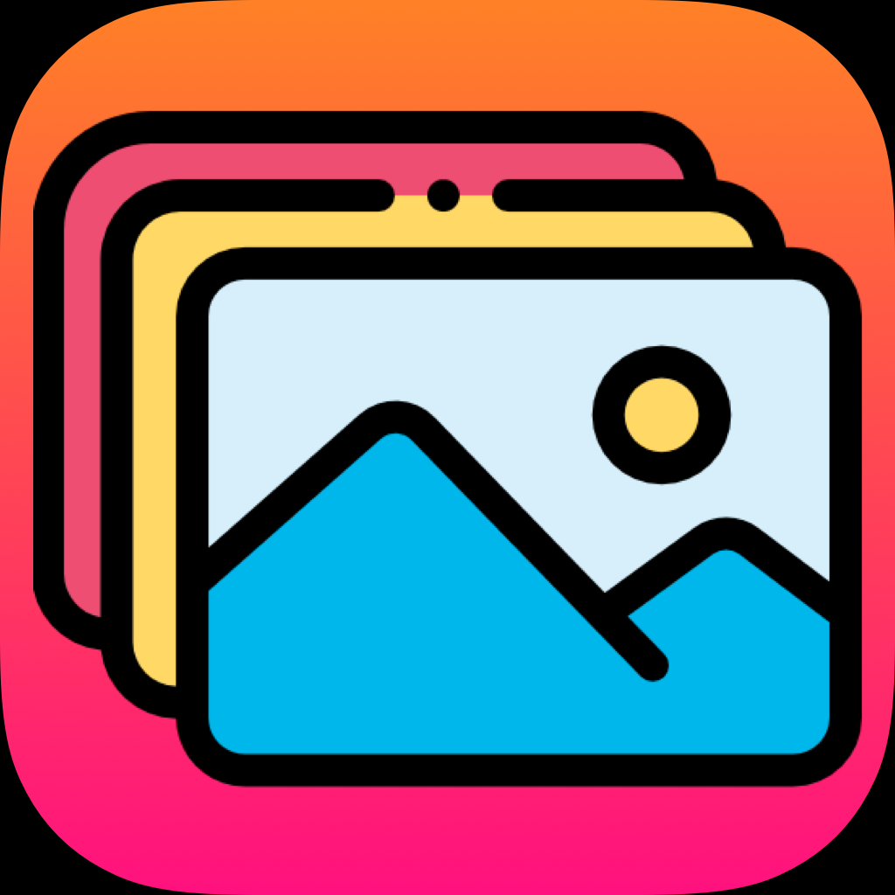

<!-- PROJECT LOGO -->
 

  

  <h3 align="center">Reddit Gallery</h3>

  

    An awesome iOS project with Reddit API
     
  

<!-- ABOUT THE PROJECT -->
## About The Project

[![Product Name Screen Shot][product-screenshot]](https://example.com)

Reddit Gallery it's a iOS project written in native Swift language. The project includes an iOS app, an iPadOS app and a macOS app. The apps use the reddit api to show the subreddit's images related to the string written in a search bar. The app use a native Swift pod for network layer, written by me. The link of network layer pod is: 
* [FalconAlamofire](https://github.com/caggiulio/FalconAlamofire). 
The pod use Alamofire library, but exists a version written with URLSession at this link: 
* [Falcon](https://github.com/caggiulio/FalconAlamofire)

<!-- MARKDOWN LINKS & IMAGES -->
<!-- https://www.markdownguide.org/basic-syntax/#reference-style-links -->
[contributors-shield]: https://img.shields.io/github/contributors/othneildrew/Best-README-Template.svg?style=flat-square
[contributors-url]: https://github.com/othneildrew/Best-README-Template/graphs/contributors
[forks-shield]: https://img.shields.io/github/forks/othneildrew/Best-README-Template.svg?style=flat-square
[forks-url]: https://github.com/othneildrew/Best-README-Template/network/members
[stars-shield]: https://img.shields.io/github/stars/othneildrew/Best-README-Template.svg?style=flat-square
[stars-url]: https://github.com/othneildrew/Best-README-Template/stargazers
[issues-shield]: https://img.shields.io/github/issues/othneildrew/Best-README-Template.svg?style=flat-square
[issues-url]: https://github.com/othneildrew/Best-README-Template/issues
[license-shield]: https://img.shields.io/github/license/othneildrew/Best-README-Template.svg?style=flat-square
[license-url]: https://github.com/othneildrew/Best-README-Template/blob/master/LICENSE.txt
[linkedin-shield]: https://img.shields.io/badge/-LinkedIn-black.svg?style=flat-square&logo=linkedin&colorB=555
[linkedin-url]: https://linkedin.com/in/othneildrew
[product-screenshot]: images/devices.png
